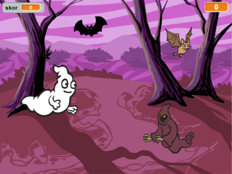

## Tantangan: benda tambahan

Dapatkah kamu menambahkan benda lain ke game kamu?

Saat kamu menambahkan benda, kamu perlu memikirkan hal-hal berikut.

+ Seberapa besar benda itu?
+ Akankah benda tampil lebih atau kurang sering dibanding hantu?
+ Seperti apa tampilan/suara saat benda tertangkap?
+ Berapa poin yang akan pemain peroleh (atau kehilangan) untuk menangkapnya?

Jika kamu perlu bantuan menambahkan benda lain, kamu dapat menggunakan kembali langkah-langkah di atas!

***
### Terjemahan Kontribusi Komunitas 

Proyek ini diterjemahkan oleh **Chris Permana** dan ditinjau oleh **Maksum Rifai**.

Relawan penerjemah kami yang luar biasa membantu kami memberi kesempatan kepada anak-anak di seluruh dunia untuk belajar kode. Anda dapat membantu kami menjangkau lebih banyak anak dengan menerjemahkan proyek kami - baca lebih lanjut di [rpf.io/translators](https://rpf.io/translators).