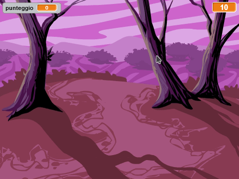
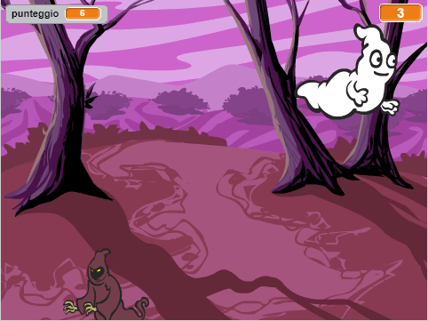

--- no-print ---

This is the **Scratch 2** version of the project. There is also a [Scratch 3 version of the project](https://projects.raspberrypi.org/it-IT/projects/ghostbusters).

--- /no-print ---

## Introduzione

Stai per creare un gioco di acchiappa-fantasmi!

### Cosa creerai

--- no-print ---

--- /no-print ---

--- print-only ---

--- /print-only ---

--- collapse ---
---
title: Di cosa avrai bisogno
---
### Hardware

+ Un computer

### Software

+ Scratch 2.0 ([online](http://rpf.io/scratchon){:target="_blank"} o [offline](http://rpf.io/scratchoff){:target="_blank"})

--- /collapse ---

--- collapse ---
---
title: Cosa imparerai
---
Questo progetto include elementi tratti dalle seguenti componenti del [Digital Making Curriculum di Raspberry Pi](http://rpf.io/curriculum){:target="_blank"}:

+ [Utilizzare i costrutti base di un linguaggio di programmazione per creare programmi semplici.](https://www.raspberrypi.org/curriculum/programming/creator)

--- /collapse ---

--- no-print ---

Se intendete stampare questo progetto, cliccate su [Versione stampabile](https://projects.raspberrypi.org/it-IT/projects/ghostbusters-scratch2/print).

--- /no-print ---