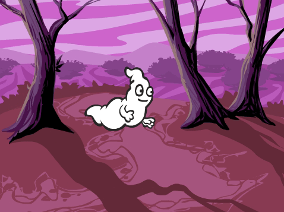
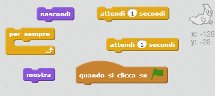

## Animare un fantasma

--- task ---

Avvia un nuovo progetto Scratch.

[[[generic-scratch-new-project]]]

--- /task ---

--- task ---

Aggiungi un nuovo sprite fantasma e uno scenario adatto a questo personaggio.

[[[generic-scratch-sprite-from-library]]]

[[[generic-scratch-backdrop-from-library]]]

--- /task ---

--- task ---

Aggiungi dei codici al tuo fantasma, in modo che appaia e scompaia ripetutamente quando fai click sulla bandierina.

--- hints --- --- hint --- `Quando clicchi su ⚑`{:class="blockevents"}, dovrai fare in modo che il tuo fantasma `sparisca`{:class="blocklooks"} per `un secondo`{:class="blockcontrol"} e poi `ricompaia`{:class="blocklooks"} per `un secondo`{:class="blockcontrol"}. Dovrà fare ciò `per sempre`{:class="blockcontrol"}. --- /hint --- --- hint --- Ecco di quali blocchi di codice avrai bisogno:  --- /hint --- --- hint --- Ecco come dovrebbe apparire il tuo codice:  --- /hint --- --- /hints ---

--- /task ---

--- task ---

Prova il tuo progetto e salvalo.

[[[generic-scratch-saving]]]

--- /task ---