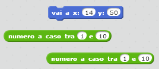
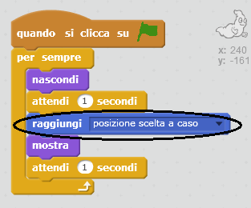
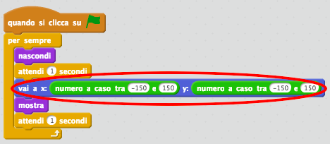

## Fantasmi a caso

Al momento, è facilissimo acchiappare il tuo fantasma, perché non si muove!

--- task ---

Puoi aggiungere dei codici per fare in modo che il tuo fantasma, invece di stare fermo nello stesso punto, compaia sullo schermo in punti a caso?

--- hints --- --- hint --- Hai bisogno che il tuo fantasma `vada` ogni volta in un punto a caso dello schermo prima di comparire. --- /hint --- --- hint --- Puoi usare ben due set di blocchi di codice diversi. Questo:  O questo:  --- /hint --- --- hint --- Il tuo codice dovrebbe apparire così:  Oppure così:  --- /hint --- --- /hints ---

--- /task ---

--- challenge ---

## Sfida: più casualità

Potresti fare in modo che il tuo fantasma `aspetti` per un periodo di tempo casuale prima di comparire? Potresti utilizzare il blocco `porta dimensione` per dare al tuo fantasma una dimensione casuale ogni volta che appare? --- /challenge ---