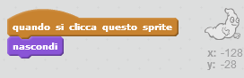

## Acchiappare i fantasmi

Facciamo in modo che il giocatore acchiappi i fantasmi!

--- task ---

Puoi fare in modo che il fantasma sparisca quando viene acchiappato?

Per acchiappare un fantasma, cliccaci sopra. Se trovi difficile acchiappare i fantasmi, puoi giocare in modalità schermo intero facendo click su questo pulsante:

--- hints --- --- hint --- Il tuo fantasma dovrebbe `sparire`{:class="blocklooks"}`quando fai click sul suo sprite`{:class="blockevents"}. --- /hint --- --- hint --- Ecco come dovrebbe apparire il tuo codice:  --- /hint --- --- /hints ---

--- /task ---

--- challenge ---

## Sfida: Aggiungere un suono

Puoi fare in modo che il tuo fantasma emetta un suono ogni volta che viene acchiappato? --- /challenge ---