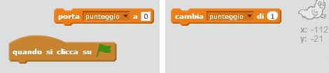

## Aggiungere un punteggio

Rendiamo il gioco più interessante tenendo il punteggio!

--- task ---

Crea una nuova variabile chiamata 'punteggio'.

[[[generic-scratch-add-variable]]]

--- /task ---

--- task ---

Puoi tenere traccia del punteggio del giocatore? I giocatori dovrebbero guadagnare punti facendo click sui fantasmi per catturarli.

Ogni volta che un giocatore fa click su un fantasma, il punteggio dovrebbe aumentare.

--- hints --- --- hint --- `Quando si clicca su ⚑`{:class="blockevents"}, la tua variabile `punteggio`{:class="blockdata"} dovrebbe `essere portata a 0`{:class="blockdata"}. Aggiungi questo codice allo sfondo. `Quando si clicca sullo sprite del fantasma`{:class="blockevents"}, la tua variabile `punteggio`{:class="blockdata"} dovrebbe `aumentare di 1`{:class="blockdata"}. --- /hint --- --- hint --- Ecco di quali blocchi di codice avrai bisogno:  --- /hint --- --- hint --- Ecco come fare punti cliccando sui fantasmi:  --- /hint --- --- /hints ---

--- /task ---