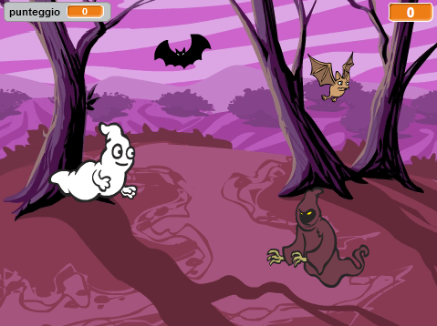

## Sfida: Altri oggetti

Puoi aggiungere altri oggetti al tuo gioco?

Rifletti sull’oggetto da aggiungere. Pensa a:

+ Quanto è grande?
+ Apparirà più o meno spesso rispetto ai fantasmi?
+ Che costume/suono avrà quando verrà acchiappato?
+ Quanti punti guadagnerai (o perderai) per averlo acchiappato?

Se hai bisogno di aiuto per aggiungere un altro oggetto, riutilizza le indicazioni qui sopra!

***
### Traduzioni della Community 

Questo progetto è stato tradotto da **Silvia Caponio** e revisionato da **Alejandro Michetti**. 

Il nostro straordinario team di traduttori volontari ci permette di dare ai bambini di tutto il mondo la possibilità di imparare a programmare. Puoi aiutarci a raggiungere più bambini traducendo i nostri progetti - scopri di più su [rpf.io/translators](https://rpf.io/translators).
