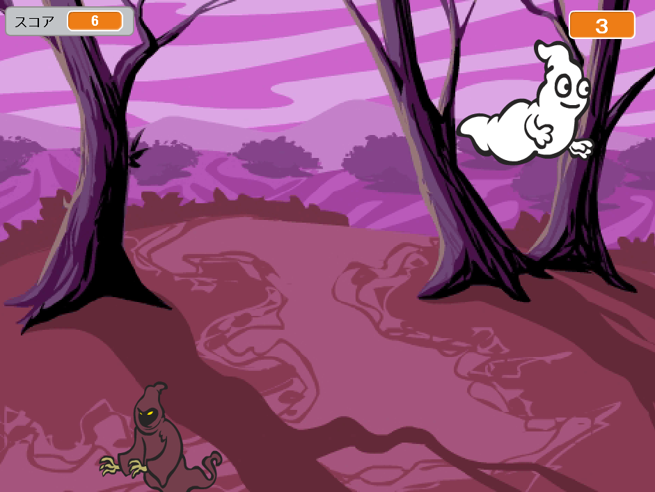

--- no-print ---

This is the **Scratch 2** version of the project. There is also a [Scratch 3 version of the project](https://projects.raspberrypi.org/ja-JP/projects/ghostbusters).

--- /no-print ---

## はじめに

おばけをつかまえるゲームを作りましょう！

### 作るもの

--- no-print ---

--- /no-print ---

--- print-only ---

--- /print-only ---

--- collapse ---
---
title: 必要なもの
---
### ハードウェア

+ コンピューター

### ソフトウェア

+ Scratch 2.0 ([オンライン](http://rpf.io/scratchon){:target="_blank"}または[オフライン](http://rpf.io/scratchoff){:target="_blank"})

--- /collapse ---

--- collapse ---
---
title: 学習すること
---
このプロジェクトでは[Raspberry Pi デジタル・メイキング・カリキュラム](http://rpf.io/curriculum){:target="_blank"}の以下の要素を学びます。

+ [基本的なプログラミング構文を使って、簡単なプログラムを作る](https://www.raspberrypi.org/curriculum/programming/creator)

--- /collapse ---

--- no-print ---

このプロジェクトを印刷する必要がある場合は、[印刷用バージョン](https://projects.raspberrypi.org/ja-JP/projects/ghostbusters-scratch2/print)を使用してください。

--- /no-print ---
