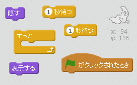
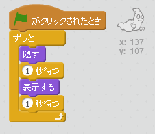

## おばけを動かす

--- task ---

新しいScratch (スクラッチ) のプロジェクトを開きましょう。

[[[generic-scratch-new-project]]]

--- /task ---

--- task ---

新しくおばけのスプライトと、ふさわしい背景（はいけい）を追加します。

[[[generic-scratch-sprite-from-library]]]

[[[generic-scratch-backdrop-from-library]]]

--- /task ---

--- task ---

旗をクリックすると、いつまでもおばけがあらわれたり消えたりするように、コードを入れてみましょう。

--- hints --- --- hint --- `緑の旗がクリックされたとき`{:class=”blockevents”}、おばけを`1秒`{:class=”blockcontrol”}`隠す`{:class=”blocklooks”} (かくす)、そして`1秒`{:class=”blockcontrol”}`表示する`{:class=”blocklooks”} 必要があります。 これを`ずっと`{:class=”blockcontrol”}行います。 --- /hint --- --- hint --- 使うブロックはこちらです。  --- /hint --- --- hint --- コードの見本はこちらです。  --- /hint --- --- /hints ---

--- /task ---

--- task ---

テストして保存 (ほぞん) しましょう。

[[[generic-scratch-saving]]]

--- /task ---