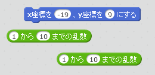
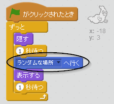
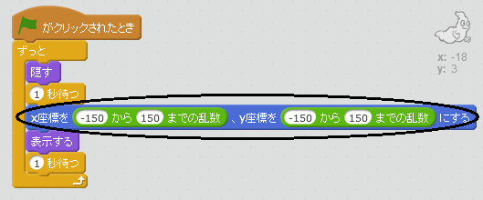

## おばけをランダムに動かす

今おばけは動かないので、とてもつかまえやすいです！

--- task ---

同じ場所にいるのではなく、画面上でランダムにあらわれるよう、おばけにコードを入れてみましょう。

--- hints --- --- hint --- あらわれる前に、おばけをステージのランダムな位置に`動かす`{:class=”blockmotion”}必要があります。 --- /hint --- --- hint --- 使用できるコードブロックは2種類あります。 1つはこれです。  もう1つはこれです。  --- /hint --- --- hint --- コードの見本はこちらです。  またはこちらです。  --- /hint --- --- /hints ---

--- /task ---

--- challenge ---

## チャレンジ: もっとランダムに

おばけがあらわれる前の`待つ`{:class=”blockcontrol”}時間をランダムにできますか？ `大きさを　%にする`{:class=”blocklooks”}ブロックを使って、おばけがあらわれるたびに大きさをランダムにできますか？ --- /challenge ---