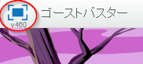
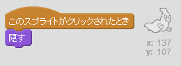

## おばけを捕まえる

プレーヤーがおばけをつかまえられるようにしましょう！

--- task ---

おばけがつかまったときに消えるようにすることはできますか？

おばけをクリックしてつかまえましょう。むずかしければ、このボタンをクリックして全画面モードで遊ぶこともできます。

--- hints --- --- hint --- `クリックされたとき`{:class=”blockevents”}、おばけのスプライトを`かくす`{:class=”blocklooks”}必要があります。 --- /hint --- --- hint --- コードの見本はこちらです。  --- /hint --- --- /hints ---

--- /task ---

--- challenge ---

## チャレンジ: 音を追加する

おばけがつかまったときに音が出るようにできますか？ --- /challenge ---