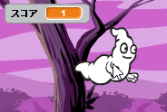
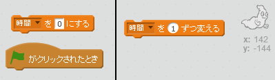
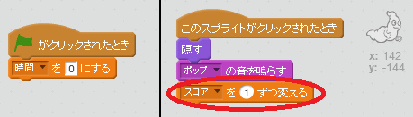

## スコアを追加する

スコアをつけてもっと面白くしましょう！

--- task ---

「スコア」という新しい変数（へんすう）を作成します。

[[[generic-scratch-add-variable]]]

--- /task ---

--- task ---

プレイヤーのスコアをつけることができますか？おばけをクリックしてつかまえると、得点できます。

プレイヤーがおばけをクリックすると、スコアがふえます。

--- hints --- --- hint --- `緑の旗がクリックされたとき`{:class=”blockevents”}、`スコア`{:class=”blockdata”}を`0にする`{:class=”blockdata”}必要があります。 ステージはこのコードを追加するのに一番いい場所です。 `おばけのスプライトがクリックされたとき`{:class=”blockevents”}、`スコア`{:class=”blockdata”}を`1ずつ変える`{:class=”blockdata”}必要があります。 --- /hint --- --- hint --- 使うブロックはこちらです。  --- /hint --- --- hint --- おばけをクリックして得点するには、こうします。  --- /hint --- --- /hints ---

--- /task ---