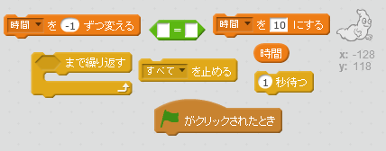
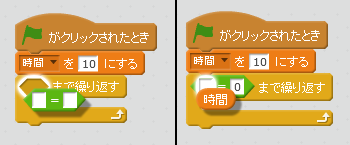

## タイマーを追加する

--- task ---

「時間」という変数（へんすう）を新しく作成します。

--- /task ---

--- task ---

ステージにタイマーを追加して、10秒以内につかまえたおばけの数を競えるようにできますか？

タイマーはこのようにします。

+ 10秒から始まる
+ 1秒ずつへっていく

タイマーが0になると、ゲームは終わります。

--- hints --- --- hint --- `緑の旗がクリックされたとき`{:class=”blockevents”}、`時間`{:class=”blockdata”}の変数（へんすう）を`10にする`{:class=”blockdata”}必要があります。 それは毎秒、`-1ずつ変える`{:class=”blockdata”}、そして`0になるまで繰り返す`{:class=”blockcontrol"}(くりかえす)必要があります。 --- /hint --- --- hint --- 使うブロックはこちらです。  --- /hint --- --- hint --- タイマーを追加するには、こうします。 

これが`時間 = 0`ブロックを作成する方法です。  --- /hint --- --- /hints ---

--- /task ---

--- task ---

友達にゲームをテストしてもらいましょう。何点とれるでしょうか？

--- /task ---

ゲームがかんたんすぎるようでしたら、こんな風にしてみましょう。

+ 時間を短くする
+ おばけをあらわれにくくする
+ おばけを小さくする

--- task ---

満足できるむずかしさになるまで、ゲームを変えてテストしましょう。

--- /task ---