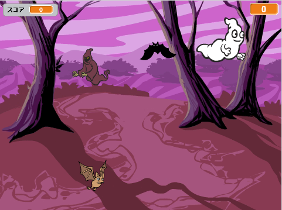

## チャレンジ：オブジェクトをふやす

ゲームに他のオブジェクトを追加できますか？

オブジェクトを追加するときは、次のことについて考えましょう。

+ 大きさはどの位ですか？
+ おばけよりも、たくさんまたは少なめに、あらわれますか？
+ つかまった時に、どのような見た目になりますか？　音はどうなりますか？
+ プレイヤーがつかまえた時に、何点とれますか？　または何点うしないますか？

別のオブジェクトを追加するには、上のやり方を使ってみましょう。

***
### コミュニティによる翻訳 

すばらしい翻訳ボランティアは、世界中の子供たちにコーディングを学ぶチャンスを与えるのに役立っています。私たちのプロジェクトを翻訳することにより、より多くの子供たちにプログラミングを学んでもらう事ができます。詳しくは[rpf.io/translators](https://rpf.io/translators)をご覧ください。
