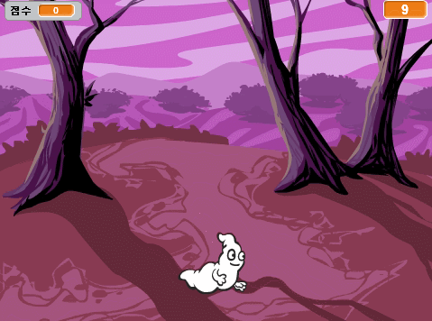
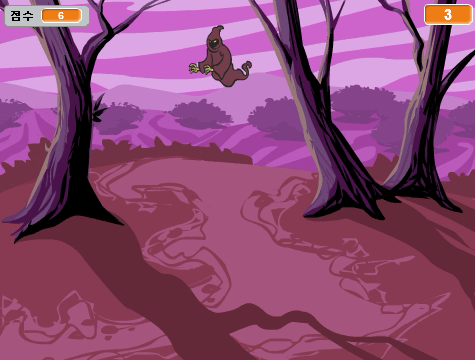

--- no-print ---

This is the **Scratch 2** version of the project. There is also a [Scratch 3 version of the project](https://projects.raspberrypi.org/ko-KR/projects/ghostbusters).

--- /no-print ---

## 소개

이제부터 유령 잡기 게임을 만들어 봅시다!

### 만들게 될 것

--- no-print ---

--- /no-print ---

--- print-only ---

--- /print-only ---

--- collapse ---
---
title: 준비물
---
### 하드웨어

+ 컴퓨터

### 소프트웨어

+ 스크래치 2.0 ( [온라인](http://rpf.io/scratchon){:target="_blank"} 또는 [offline](http://rpf.io/scratchoff){:target="_blank"})

--- /collapse ---

--- collapse ---
---
title: 배우게 될 것
---
이 프로젝트는 [라즈베리파이 디지털 메이킹 커리큘럼](http://rpf.io/curriculum) 중 아래의 과정에 있는 요소들을 다룹니다.

+ [기본 프로그래밍 문법으로 간단한 프로그램 만들기](https://www.raspberrypi.org/curriculum/programming/creator)

--- /collapse ---

--- no-print ---

이 프로젝트를 인쇄하려면 [프린트용 문서](https://projects.raspberrypi.org/ko-KR/projects/ghostbusters-scratch2/print)를 사용하십시오.

--- /no-print ---