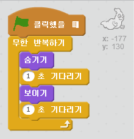

## 유령 움직여 보기

--- task ---

새 스크래치 프로젝트 만들기

[[[generic-scratch-new-project]]]

--- /task ---

--- task ---

새 유령 스프라이트를 추가하고 어울리는 배경을 넣으세요.

[[[generic-scratch-sprite-from-library]]]

[[[generic-scratch-backdrop-from-library]]]

--- /task ---

--- task ---

깃발을 클릭했을 때 유령이 계속 나타났다 사라지도록 코드를 추가하세요.

--- hints --- --- hint --- `녹색 깃발이 클릭되면`{:class=”blockevents”}, 유령들을 `1초 동안`{:class=”blockcontrol”} `숨기기`{:class=”blocklooks”} 로 숨겼다가 `1초 동안`{:class=”blockcontrol”} `보이기`{:class=”blocklooks”} 로 보여줘야 합니다. 이 작업을 `무한 반복하기`{:class=”blockcontrol”} 로 해야합니다. --- /hint --- --- hint --- 필요한 코드 블럭은 다음과 같습니다.  --- /hint --- --- hint --- 코드는 이런 형태로 만들어져야 합니다.  --- /hint --- --- /hints ---

--- /task ---

--- task ---

프로젝트를 테스트해 보고 저장하세요.

[[[generic-scratch-saving]]]

--- /task ---
