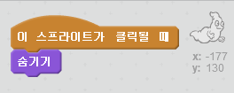

## 유령 잡기

플레이어가 유령을 잡을 수 있게 해 봐요!

--- task ---

유령이 잡히면 사라지게 만들 수 있나요?

유령을 클릭해서 잡을 수 있어야 합니다. 만약 잡기 어려우면 다음 버튼을 클릭해서 게임을 전체 화면으로 플레이해 보세요.

--- hints --- --- hint --- `클릭되면`{:class="blockevents"}, 유령 스프라이트는 `숨기기`{:class="blocklooks"} 되어야 합니다. --- /hint --- --- hint --- 코드는 다음과 같아야 합니다.  --- /hint --- --- /hints ---

--- /task ---

--- challenge ---

## 도전과제: 소리 추가하기

유령이 잡힐 때 마다 소리가 나게 할 수 있나요? --- /challenge ---
