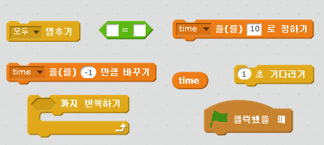
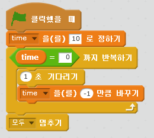
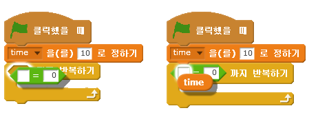

## 타이머 추가하기

--- task ---

'시간'이라는 새 변수를 추가합니다.

--- /task ---

--- task ---

무대에 타이머를 추가해서 플레이어가 10초 동안만 유령을 잡게 만들 수 있나요?

타이머는 이렇게 동작해야 해요.

+ 10초부터 시작합니다.
+ 매 초 숫자가 줄어듭니다.

타이머가 0이 되면 게임이 끝나야 합니다.

--- hints --- --- hint --- `녹색 깃발이 클릭되면`{:class=”blockevents”}, `시간`{:class=”blockdata”} 변수는 `10으로 정하기`{:class=”blockdata”}로 초기화 되어야 합니다. 그리고 나서는 `0이 되기 전까지`{:class=”blockcontrol"}매 초마다 `-1만큼 바꾸기`{:class=”blockdata”}로 변해야 합니다 --- /hint --- --- hint --- 다음과 같은 코드 블럭이 필요합니다.  --- /hint --- --- hint --- 게임에 타이머를 추가하는 방법은 이렇습니다. 

`time = 0`블럭을 다음처럼 만들 수 있습니다:  --- /hint --- --- /hints ---

--- /task ---

--- task ---

친구에게 게임을 테스트해 보라고 하세요. 몇 점을 획득하나요?

--- /task ---

만약 게임이 너무 쉽다면 다음과 같이 바꿀 수 있습니다.

+ 플레이 시간을 줄여 보세요.
+ 유령이 덜 나타나게 바꿔 보세요.
+ 유령의 크기를 줄여 보세요.

--- task ---

게임의 난이도가 적절하다고 느껴질 때까지 플레이하면서 게임을 바꿔 보세요.

--- /task ---
