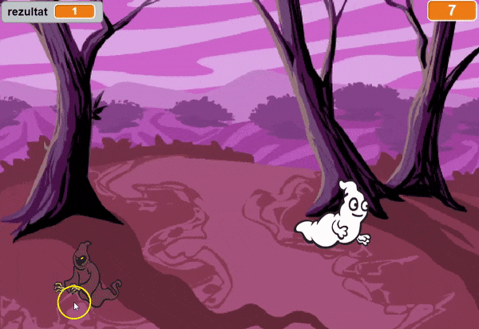
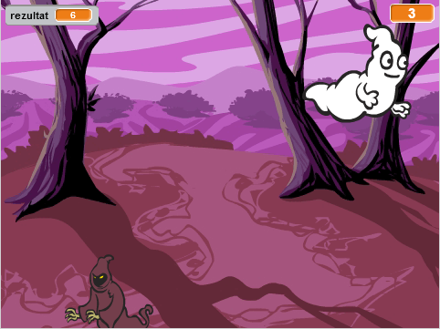

--- no-print ---

This is the **Scratch 2** version of the project. There is also a [Scratch 3 version of the project](https://projects.raspberrypi.org/me-ME/projects/ghostbusters).

--- /no-print ---

## Uvod

Napravićeš igru hvatanja duhova!

### Šta ćeš napraviti

--- no-print ---

--- /no-print ---

--- print-only ---

--- /print-only ---

--- collapse ---
---
title: Šta će ti biti potrebno
---
### Hardver

+ Računar

### Softver

+ Scratch 2.0 ([online](http://rpf.io/scratchon){:target="_blank"} ili [offline](http://rpf.io/scratchoff){:target="_blank"})

--- /collapse ---

--- collapse ---
---
title: Šta ćeš naučiti
---
Ovim projektom obuhvaćeni su elementi iz sljedećih dijelova [Raspberry Pi Digital Making Curriculum](http://rpf.io/curriculum){:target="_blank"}:

+ [Koristite osnovne programske konstrukcije za kreiranje jednostavnih programa.](https://www.raspberrypi.org/curriculum/programming/creator)

--- /collapse ---

--- no-print ---

Ukoliko je potrebno da odštampaš ovaj projekat, koristi [Verziju za štampu](https://projects.raspberrypi.org/me-ME/projects/ghostbusters-scratch2/print).

--- /no-print ---