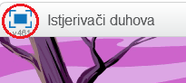

## Hvatanje duhova

Hajde da omogućimo igraču da hvata duhove!

--- task ---

Da li možeš da napraviš da tvoj duh nestane kada je uhvaćen?

Treba da klikneš na duhove kako bi ih uhvatio/uhvatila. Ako ti je teško da hvataš duhove, možeš da igraš igru na cijelom ekranu tako što ćeš kliknuti na ovo dugme:

--- hints --- --- hint --- `Kada se klikne`{:class=”blockevents”} (when clicked) na lik duha, on treba da `se sakrije`{:class=”blocklooks”} (hide). --- /hint --- --- hint --- Tvoj kôd treba da izgleda ovako:  --- /hint --- --- /hints ---

--- /task ---

--- challenge ---

## Izazov: dodavanje zvuka

Da li možeš da napraviš da tvoj duh proizvodi zvuk svaki put kada je uhvaćen?