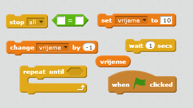
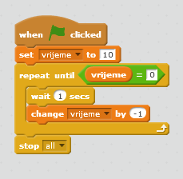
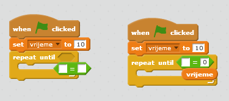

## Dodavanje mjerača vremena

--- task ---

Kreiraj novu promjenljivu (variable) pod nazivom 'vrijeme'.

--- /task ---

--- task ---

Možeš li da dodaš mjerač vremena na svoju Pozornicu (Stage) kako bi tvoj igrač imao samo 10 sekundi da uhvati što više duhova?

Tvoj mjerač vremena treba da:

+ Počne sa 10 sekundi
+ Odbrojava svaku sekundu

Igra treba da se završi kada mjerač vremena dođe do 0.

--- hints --- --- hint --- `Kada je kliknuto na zelenu zastavicu`{:class=”blockevents”} (when the green flag is clicked), tvoja promjenljiva `vrijeme`{:class=”blockdata”} treba da bude `postavljena na 10`{:class=”blockdata”} (set to 10). Zatim treba svake sekunde da se `promijeni za -1`{:class=”blockdata”} (change by -1) `dok ne dođe do 0`{:class=”blockcontrol"}. --- /hint --- --- hint --- Ovdje su blokovi kôda koje treba da koristiš:  --- /hint --- --- hint --- Ovako ćeš da dodaš mjerač vremena u svoju igru: 

A ovako ćeš da napraviš blok `vrijeme = 0`:  --- /hint --- --- /hints ---

--- /task ---

--- task ---

Zamoli prijatelja da isproba tvoju igru. Koliko bodova može da osvoji?

--- /task ---

Ako je tvoja igra previše laka, možeš da uradiš sljedeće:

+ Daj igraču manje vremena
+ Napravi da se duhovi pojavljuju rjeđe
+ Smanji duhove

--- task ---

Izmijeni i isprobaj svoju igru nekoliko puta, dok ne procijeniš da je dovoljno teška.

--- /task ---