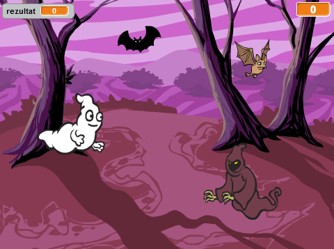

## Izazov: više objekata

Možeš li da dodaš još objekata u svoju igru?

Kada dodaješ objekat, potrebno je da razmisliš o sljedećem:

+ Koliko je objekat veliki?
+ Da li će se pojavljivati češće ili rjeđe od duha?
+ Kako će izgledati/zvučati kada bude uhvaćen?
+ Koliko će bodova igrač dobiti (ili izgubiti) kada ga uhvati?

Ako ti je potrebna pomoć u dodavanju novog objekta, ponovi prethodne korake!