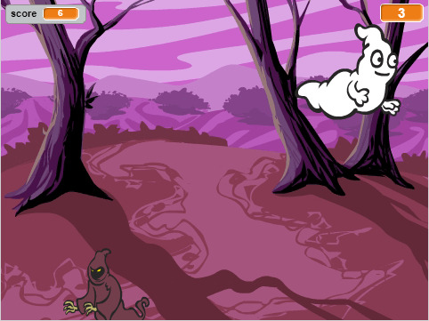

--- no-print ---

This is the **Scratch 2** version of the project. There is also a [Scratch 3 version of the project](https://projects.raspberrypi.org/nl-NL/projects/ghostbusters).

--- /no-print ---

## Inleiding

Je gaat een spookachtig spel maken!

### Wat ga je maken

--- no-print ---

--- /no-print ---

--- print-only ---

--- /print-only ---

--- collapse ---
---
title: Wat heb je nodig
---
### Hardware

+ Een computer

### Software

+ Scratch 2.0 (of [online](http://rpf.io/scratchon){:target="_blank"} of [offline](http://rpf.io/scratchoff){:Target="_blank"})

--- /collapse ---

--- collapse ---
---
title: Wat ga je leren
---
Dit project behandelt elementen uit de volgende onderdelen van de[Raspberry Pi Digital Making Curriculum](http://rpf.io/curriculum){:target="_blank"}:

+ [Gebruik basale programmeerconstructies om eenvoudige programma's te maken.](https://www.raspberrypi.org/curriculum/programming/creator)

--- /collapse ---

--- no-print ---

Als je dit project wilt afdrukken, gebruik dan de [printvriendelijke versie](https://projects.raspberrypi.org/nl-NL/projects/ghostbusters-scratch2/print).

--- /no-print ---