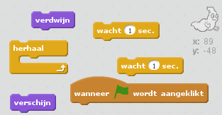
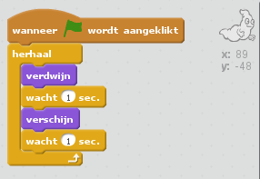

## Beweeg een spook

--- task ---

Open een nieuw leeg Scratch-project.

[[[generic-scratch-new-project]]]

--- /task ---

--- task ---

Voeg een nieuwe Spook Sprite (Ghost) toe, en een geschikte achtergrond.

[[[generic-scratch-sprite-from-library]]]

[[[generic-scratch-backdrop-from-library]]]

--- /task ---

--- task ---

Voeg code toe aan je spook zodat die steeds weer verschijnt en verdwijnt als je op de vlag klikt.

--- hints --- --- hint --- Nadat op `de groene vlag wordt geklikt`{:class="blockevents"}, moet je spook voor `één seconde`{:class="blockcontrol"} `verdwijnen`{:class="blocklooks"} en vervolgens voor `één seconde`{:class="blockcontrol"}` verschijnen`{:class="blocklooks"}. Dit zal zich steeds moeten `herhalen`{:class=”blockcontrol”}. --- /hint --- --- hint --- Dit zijn de blokken die je nodig hebt:  --- /hint --- --- hint --- Zo zou het programma eruit moeten zien:  --- /hint --- --- /hints ---

--- /task ---

--- task ---

Test en sla je project op.

[[[generic-scratch-saving]]]

--- /task ---