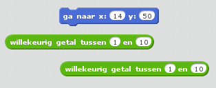
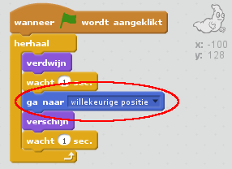
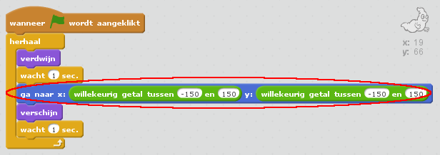

## Willekeurige spoken

Je spook is op dit moment heel gemakkelijk te vangen, omdat hij niet beweegt!

--- task ---

Kun je code aan je spook toevoegen, zodat die op willekeurige posities op het scherm verschijnt, in plaats van steeds op dezelfde plaats?

--- hints --- --- hint --- Je wilt dat het spook met een `ga naar`{:class="blockmotion"} naar een willekeurige plaats gaat voordat die elke keer verschijnt. --- /hint --- --- hint --- Er zijn twee sets codeblokken die je kunt gebruiken. Deze:  Of deze:  --- /hint --- --- hint --- Je programma zou er zo uit moeten zien:  Of het kan er zo uitzien:  --- /hint --- --- /hints ---

--- /task ---

--- challenge ---

## Uitdaging: meer willekeur

Kun je je spook een willekeurige tijd laten wachten met `wacht`{:class="blockcontrol"} voordat die verschijnt? Kun je met het `maak grootte`{:class="blocklooks"} blok het spook een willekeurige grootte geven, elke keer dat deze verschijnt? --- /challenge ---