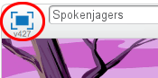
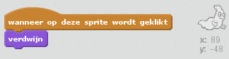

## Spoken vangen

Laten we de speler de gelegenheid geven om ​spoken te vangen!

--- task ---

Kun je je spook laten verdwijnen als deze is gepakt?

Je moet op de spoken kunnen klikken om ze te vangen. Als je het vangen moeilijk vindt kun je het spel in volledig schermmodus spelen door op deze knop te klikken:

--- hints --- --- hint --- `Wanneer op je sprite wordt geklikt`{:class="blockevents"}, zou het spook moeten `verdwijnen`{:class="blocklooks"}. --- /hint --- --- hint --- Je programma zou er zo uit moeten zien:  --- /hint --- --- /hints ---

--- /task ---

--- challenge ---

## Uitdaging: geluid toevoegen

Kun je je spook een geluid laten maken als die wordt gevangen? --- /challenge ---