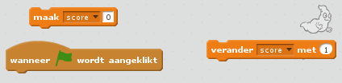
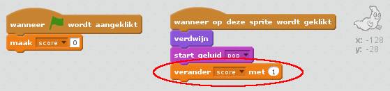

## Een score toevoegen

Laten we het interessanter maken door de score bij te houden!

--- task ---

Maak een nieuwe variabele met de naam 'score'.

[[[generic-scratch-add-variable]]]

--- /task ---

--- task ---

Kun je de score van een speler bijhouden? Spelers zouden punten moeten scoren als ze spoken vangen door er op te klikken.

Elke keer dat een speler op een spook klikt, zou de score moeten stijgen.

--- hints --- --- hint --- `Wanneer op de groene vlag wordt geklikt`{:class="blockevents"}, zou de `score`{:class="blockdata"} op `0`{:class="blockdata"} moeten staan. Het speelveld is de beste plaats om deze code neer te zetten. `Wanneer op de Ghost Sprite wordt geklikt`{:class="blockevents"}, moet de `score `{:class="blockdata"} met 1 `worden opgehoogd`{:class="blockdata"}. --- /hint --- --- hint --- Dit zijn de codeblokken die je nodig hebt:  --- /hint --- --- hint --- Zo zou je punten moeten scoren door op de geest te klikken:  --- /hint --- --- /hints ---

--- /task ---