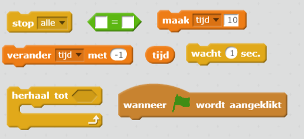
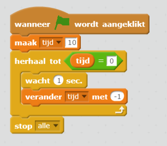
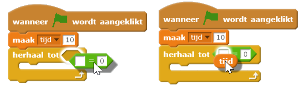

## Een tijdklok toevoegen

--- task ---

Maak een nieuwe variabele met de naam 'tijd'.

--- /task ---

--- task ---

Kun je een timer toevoegen aan het speelveld zodat de speler maar 10 seconden de tijd heeft om zoveel mogelijk spoken te vangen?

Je timer zou moeten:

+ Beginnen met 10 seconden
+ Elke seconde aftellen

Het spel zou moeten stoppen als de timer op 0 komt.

--- hints --- --- hint --- `Wanneer op de groene vlag wordt geklikt`{:class="blockevents"}, zou de `tijd`{:class="blockdata"} op `10`{:class="blockdata"} moeten staan. Het zou dan elke seconde moeten `veranderen met -1`{:class="blockdata"} totdat deze `0 bereikt`{:class="blockcontrol"}. --- /hint --- --- hint --- Dit zijn de codeblokken die je nodig hebt:  --- /hint --- --- hint --- Hier zie je hoe je de tijdklok aan je spel kunt toevoegen: 

En zo maak je het `tijd = 0` blok:  --- /hint --- --- /hints ---

--- /task ---

--- task ---

Vraag een vriend om je spel te testen. Hoeveel punten kan die scoren?

--- /task ---

Als je spel te gemakkelijk is, kun je:

+ De speler minder tijd geven
+ De spoken minder vaak laten verschijnen
+ De spoken kleiner maken

--- task ---

Verander en test je spel een paar keer totdat je tevreden bent met de moeilijkheidsgraad.

--- /task ---