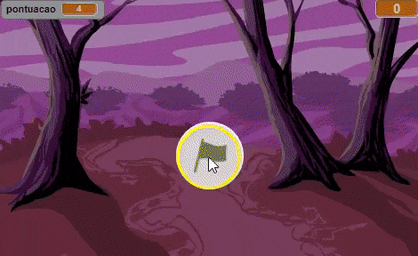
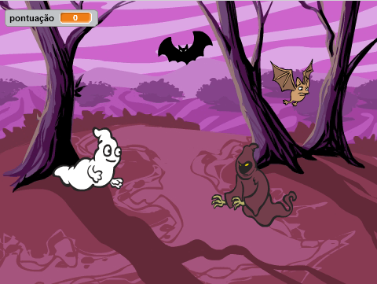

--- no-print ---

This is the **Scratch 2** version of the project. There is also a [Scratch 3 version of the project](https://projects.raspberrypi.org/pt-BR/projects/ghostbusters).

--- /no-print ---

## Introdução

Você vai criar um jogo de Caça-Fantasmas!

### O que você vai fazer

--- no-print ---

--- /no-print ---

--- print-only ---

--- /print-only ---

--- collapse ---
---
title: O que você vai precisar
---
### Hardware

+ Um computador

### Software

+ Scratch 2.0 ([online](http://rpf.io/scratchon){:target="_blank"} ou [offline](http://rpf.io/scratchoff){:target="_blank"})

--- /collapse ---

--- collapse ---
---
title: O que você vai aprender
---
Este projeto abrange elementos das seguintes vertentes do [Currículo de Criação Digital Raspberry Pi](http://rpf.io/curriculum){:target="_blank"}:

+ [Use estruturas de programação básicas para criar programas simples.](https://www.raspberrypi.org/curriculum/programming/creator)

--- /collapse ---

--- no-print ---

Se você precisar imprimir este projeto, use a [versão para impressão](https://projects.raspberrypi.org/pt-BR/projects/ghostbusters-scratch2/print).

--- /no-print ---