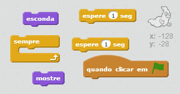

## Animando um fantasma

--- task ---

Abra um novo projeto no Scratch.

[[[generic-scratch-new-project]]]

--- /task ---

--- task ---

Adicione um novo ator de fantasma e um pano de fundo adequado para o seu palco.

[[[generic-scratch-sprite-from-library]]]

[[[generic-scratch-backdrop-from-library]]]

--- /task ---

--- task ---

Adicione código ao seu fantasma para que ele apareça e desapareça quando você clicar na bandeira.

--- hints --- --- hint --- Assim que a `bandeira for clicada`{:class=”blockevents”}, você precisará fazer o seu fantasma `se esconder`{:class=”blocklooks”} por `um segundo`{:class=”blockcontrol”} e então `aparecer`{:class=”blocklooks”} por `um segundo`{:class=”blockcontrol”}. Será necessário fazer isso `sempre`{:class = "blockcontrol"}. --- /hint --- --- hint --- Aqui estão os blocos de códigos que você vai precisar:  --- /hint --- --- hint --- Veja como seu código deve ficar:  --- /hint --- --- /hints ---

--- /task ---

--- task ---

Teste e salve seu projeto.

[[[generic-scratch-saving]]]

--- /task ---