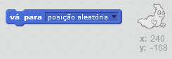
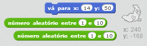

## Fantasmas aleatórios

Seu fantasma é realmente fácil de pegar no momento já que ele não se move!

--- task ---

Você pode adicionar código ao seu fantasma para que, ao invés de ficar na mesma posição, ele apareça aleatoriamente na tela?

--- hints --- --- hint --- Você quer que o seu fantasma `vá para`{:class=”blockmotion”} uma posição aleatória no palco antes de aparcer novamente. --- /hint --- --- hint --- Existem dois conjuntos de blocos de código que você pode usar. Este:  Ou este:  --- /hint --- --- hint --- Seu código deve ser parecido com isto: <2 /> Ou pode ser assim: <3 /> --- /hint --- --- /hints ---

--- /task ---

--- challenge ---

## Desafio: Mais aleatoriedade

Você pode fazer o seu fantasma `esperar`{:class="blockcontrol"} um tempo aleatório antes de aparecer? Você pode usar o bloco `mude o tamanho para`{:class ="blocklooks"} para fazer seu fantasma ter um tamanho aleatório a cada vez que ele aparecer? --- /challenge ---