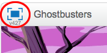
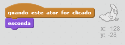

## Caçando fantasmas

Vamos permitir que o jogador cace fantasmas!

--- task ---

Você pode fazer seu fantasma desaparecer quando ele for pego?

Você deve ser capaz de clicar nos fantasmas para pegá-los. Se achar difícil capturá-los, você pode jogar o jogo no modo tela cheia clicando neste botão:

--- hints --- --- hint --- `Quando clicado`{:class="blockevents"}, seu ator fantasma deve `esconder-se`{:class="blocklooks"}. --- /hint --- --- hint --- Seu código deve ficar assim: 

--- /hint --- --- /hints ---

--- /task ---

--- challenge ---

## Desafio: Adicionando som

Você consegue fazer o seu fantasma emitir um som a cada vez que ele for pego? --- /challenge ---