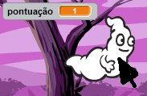
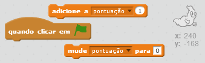
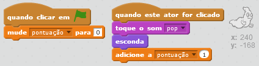

## Adicionando uma pontuação

Vamos tornar as coisas mais interessantes e manter uma pontuação!

--- task ---

Crie uma nova variável chamada 'pontuação'.

[[[generic-scratch-add-variable]]]

--- /task ---

--- task ---

Você consegue acompanhar a pontuação do jogador? Os jogadores marcam pontos ao clicar nos fantasmas para pegá-los.

Cada vez que um jogador clicar em um fantasma, sua pontuação deve aumentar.

--- hints --- --- hint --- `Quando a bandeira for clicada`{:class=”blockevents”}, sua variável `pontuação`{:class=”blockdata”} deve `mudar para 0`{:class=”blockdata”}. O Palco é o melhor lugar para adicionar esse código. `Quando o ator fantasma for clicado`{:class="blockevents"}, a `pontuação`{:class ="blockdata"} deve ser `adicionado 1`{:class="blockdata"} ponto.
--- /hint --- 
--- hint --- 
Aqui estão os blocos de códigos que você vai precisar:

--- /hint --- 
--- hint --- 
Veja como seu código deve ficar: 
 
--- /hint --- 
--- /hints ---

--- /task ---