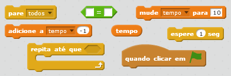
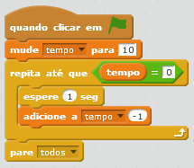
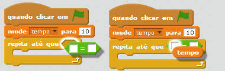

## Adicionando um cronômetro

--- task ---

Crie uma nova variável chamada 'tempo'.

--- /task ---

--- task ---

Você pode adicionar um cronômetro ao seu Palco para dar ao seu jogador apenas 10 segundos para capturar tantos fantasmas quanto possível?

Seu cronômetro deve:

+ Começar em 10 segundos
+ Contar cada segundo

O jogo deve parar quando o cronômetro chegar a 0.

--- hints --- --- hint --- `Quando a bandeira for clicada`{:class=”blockevents”}, sua variável `tempo`{:class=”blockdata”} deve `mudar para 10`{:class=”blockdata”}. Deve então `mudar em -1`{:class ="blockdata"} a cada segundo `até atingir 0`{:class="blockcontrol"}. --- /hint --- --- hint --- Aqui estão os blocos de código que você vai precisar:  --- /hint --- --- hint --- Isto é como seu código deve se parecer: 

E aqui está como criar o bloco `tempo = 0`:  --- /hint --- --- /hints ---

--- /task ---

--- task ---

Peça a um amigo para testar o seu jogo. Quantos pontos ele consegue marcar?

--- /task ---

Se o seu jogo estiver muito fácil, você pode:

+ Dar ao jogador menos tempo
+ Fazer os fantasmas aparecerem com menos frequência
+ Diminuir o tamanho dos fantasmas

--- task ---

Mude e teste seu jogo algumas vezes até que você esteja satisfeito com o nível de dificuldade.

--- /task ---