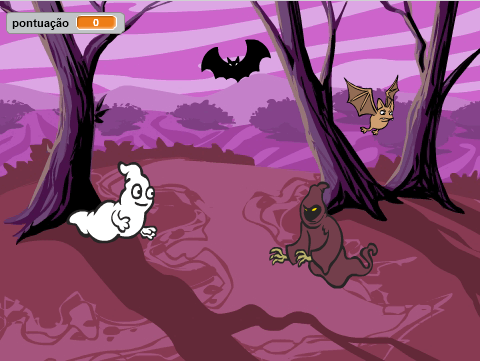

## Desafio: Mais objetos

Você pode adicionar outros objetos ao seu jogo?

Ao adicionar um objeto, você precisa considerar as seguintes coisas.

+ Quão grande é o objeto?
+ Ele vai aparecer mais ou menos vezes que o fantasma?
+ Qual vai ser a aparência ou o som emitido quando ele for capturado?
+ Quantos pontos o jogador vai marcar (ou perder) por pegá-lo?

Se você precisar de ajuda para adicionar outro objeto, você pode reutilizar as etapas acima!
***
### Tradução Contribuída pela Comunidade 

Este projeto foi traduzido por **Luciana Bezerra / Elton Marques** e revisado por **Laura Fuciarelli**. 

Nossos incríveis voluntários de tradução nos ajudam a dar as crianças em todo o mundo a oportunidade de aprender a programar. Você pode nos ajudar a alcançar mais crianças traduzindo nossos projetos - leia mais em [rpf.io/translators](https://rpf.io/translators).
