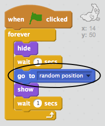

## 随机鬼怪

此时你的鬼怪非常容易被捉到，因为它不会移动！

+ 你能否向你的鬼怪添加代码，使其出现在画面的任意位置而非停留在同一位置？

--- hints ---
--- hint ---
你希望你的鬼怪在每次出现之前 `移到` 工作区的任一位置。
--- /hint ---
--- hint ---
有两组代码块可供你使用。
这组：

或这组：

--- /hint ---
--- hint ---
你的代码应如下所示：

或者如下所示：

--- /hint ---
--- /hints ---

--- challenge ---
## 挑战：更多随机性
你能否让你的鬼怪在出现之前 `等待` 任意的时间？你能否使用 `设定大小` 代码块来使你的鬼怪每次出现时的尺寸随机？
--- /challenge ---
