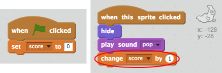

## 添加分数

让我们来通过保存分数营造出更有趣的效果！

+ 创建一个名为“分数”的新变量。

[[[generic-scratch-add-variable]]]

+ 你能否记录玩家的分数？玩家应通过点击鬼怪来捉住它们，以此来获取得分。

     玩家每次点击一个鬼怪，他们的得分就会增加。

    

--- hints ---
--- hint ---
`当绿色旗帜被点击`，你的 `分数` 变量就会 `设定为 0`。工作区是添加此代码的最佳位置。`当鬼怪子图被点击`，`分数` 就会 `增加 1`。
--- /hint ---
--- hint ---
以下是你将需要使用的代码块：

--- /hint ---
--- hint ---
下面显示了如何通过点击鬼怪来获取得分：

--- /hint ---
--- /hints ---
