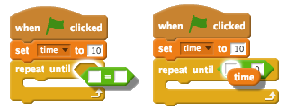

## 添加计时器

+ 创建一个名为“时间”的新变量。

+ 你能否向你的工作区添加一个计时器，仅给你的玩家 10 秒时间来捕捉尽可能多的鬼怪？

	 你的计时器应该：

	+ 从 10 秒开始
	+ 倒数每秒
	
	游戏应在计时器数到 0 时结束。

--- hints ---
--- hint ---
`当绿色旗帜被点击`，你的 `时间` 变量就会 `设定为 10`。它随后应每秒 `增加 -1`，`直到为 0`。
--- /hint ---
--- hint ---
以下是你将需要使用的代码块：

--- /hint ---
--- hint ---
下面显示了如何向你的游戏添加计时器：

下面显示了如何创建 `时间 = 0` 代码块：

--- /hint ---
--- /hints ---

+ 请一个朋友来测试你的游戏。他们能得多少分？
	
	如果你的游戏太过简单，你可以：

	+ 给玩家更少时间
	+ 使鬼怪出现的频率降低
	+ 使鬼怪变得更小

	更改你的游戏并测试几次，直至你对其难度感到满意。
